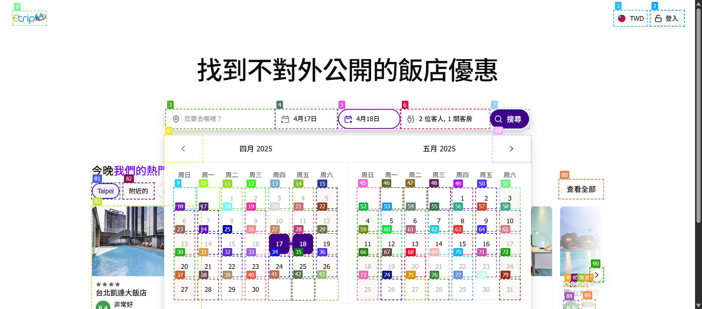
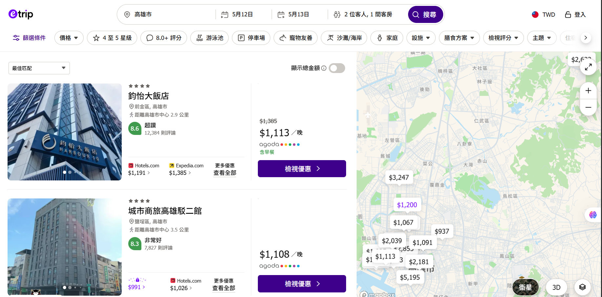
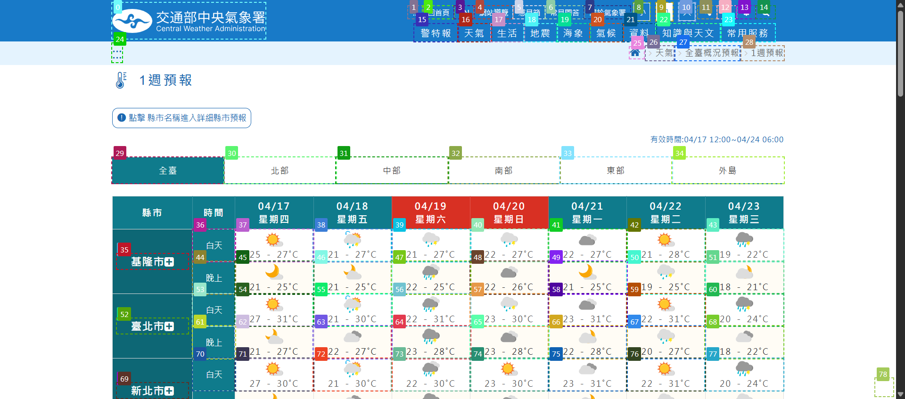
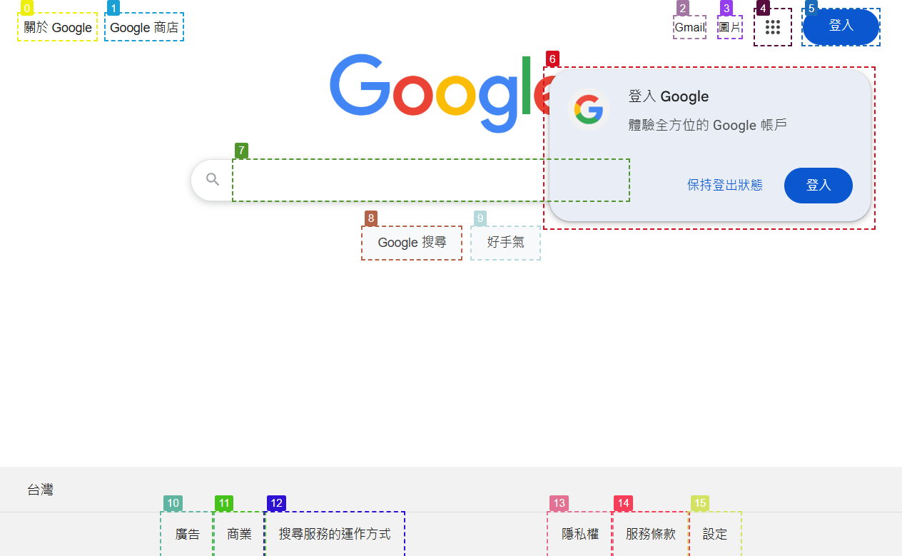
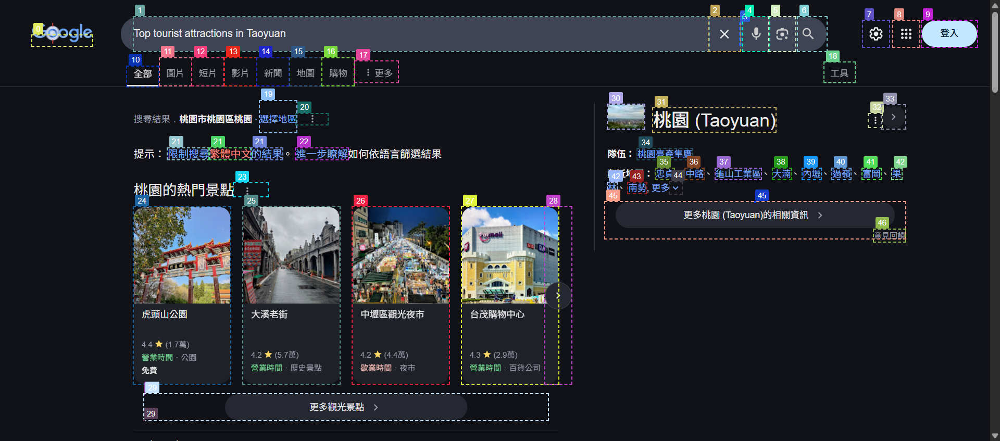

<!-- metadata: category=hotel_search -->
## Hotel Search  

### Function Description  
This page provides hotel search functionality, including the following fields and operations:  

1. 【Search Destination】(Tag3): Enter the desired destination. Required
    - Format: City name
2. 【Check-in Date】(Tag 4): Select the hotel check-in date. Required
    - Format: Month Day
3. 【Check-out Date】(Tag 5): Select the hotel check-out date. Required
    - Format: Month Day
4. 【Number of Guests and Rooms】(Tag 6): Select the number of guests and rooms. Optional
5. 【Previous Month】(Tag 8): Go to the previous month. Optional
6. 【Next Month】(Tag 44): Go to the next month. Optional
7. 【Search】(Tag 7): Start search.

### Task Demonstration Process  
- Image Description1
    1. Enter "______" in the 【Destination】 field (Tag 3).
    2. **Click** 【Check-in Date】 (Tag 4).
    3. If the desired booking month is earlier than the currently displayed month, **click** 【Previous Month】 (Tag 8).
    4. If the desired booking month is later than the currently displayed month, **click** 【Next Month】 (Tag 44).
    5. If the current month contains the target date, **click** to select the date (Tag 9-43, 45-79).
    6. **Click** 【Check-out Date】 (Tag 5).
    7. Repeat Step 3 to Step 5.
    8. Check 【Number of Guests and Rooms】 to see if it matches the requirement; otherwise, **click** to modify.
    9. **Click** 【Search】 (Tag 7) to start searching. 
- Image Description2
    1. If a suitable hotel is found, return the hotel **name**, **price**, **number of guests**, and **dates** as the **ANSWER**.

### Image Description1   

### Image Description2

---
<!-- metadata: category=weather_forecast -->
## Weather Forecast   

### Function Description  
This page provides weather forecast services, including the following main fields and operations:   
1. 【All Taiwan】(Tag29): View weather information for all of Taiwan.
2. 【Northern Region】(Tag30): View weather for Northern Taiwan, including Keelung, Taipei, New Taipei, Taoyuan, Hsinchu City, Hsinchu County, and Miaoli County.
3. 【Central Region】(Tag31): View weather for Central Taiwan, including Taichung, Changhua County, Nantou County, Yunlin County, Chiayi City, and Chiayi County
4. 【Southern Region】(Tag32): View weather for Southern Taiwan, including Tainan, Kaohsiung, and Pingtung County.
5. 【Eastern Region】(Tag33): View weather for Eastern Taiwan, including Yilan County, Hualien County, and Taitung County.
6. 【Outlying Islands】(Tag34): View weather for Taiwan's outlying islands, including Penghu, Kinmen, and Matsu.

### Task Demonstration Process  
1. **Click** Northern, Central, Southern, Eastern, or Outlying Islands according to the target area.
2. Look for the target weather information.
3. Scroll down if not found.
4. based on this page, provide the weather for the day as **the answer to the task**. 

### Image Description

---
## Tourist Attraction Search

### Function Description
This feature uses Google to search for relevant tourist attractions, including the following fields and operations:

- Image Description1  
1. 【Search】(Tag7): Enter the tourist attraction. Required
    - Format: City Name + Attraction Name
2. 【Query】(Tag8): Start searching.
- Image Description2  
1. 【Search result】(Tag1): Search result.
2. 【Arrow】(Tag28): Click to get more information about the attraction.
3. 【Information】(Tag29): Click to obtain further tourist attraction details.

### Task Demonstration Process
1. Enter _____ popular attractions into 【Search】 (Tag7).
2. After the page navigation, if the 【Search result】 (Tag1) meets the task requirements, proceed to query the task target based on the search results.
3. **Click** 【Arrow】 (Tag28) or 【Information】 (Tag29) to get more detailed information.

### Image Description1

### Image Description2
