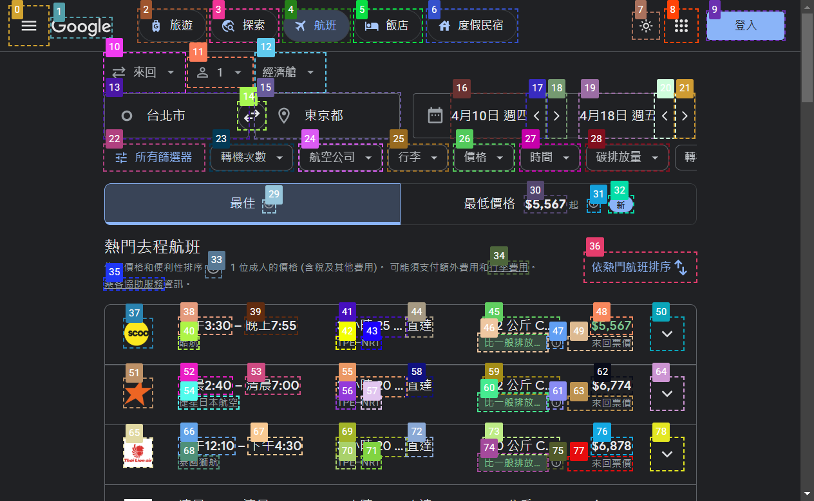
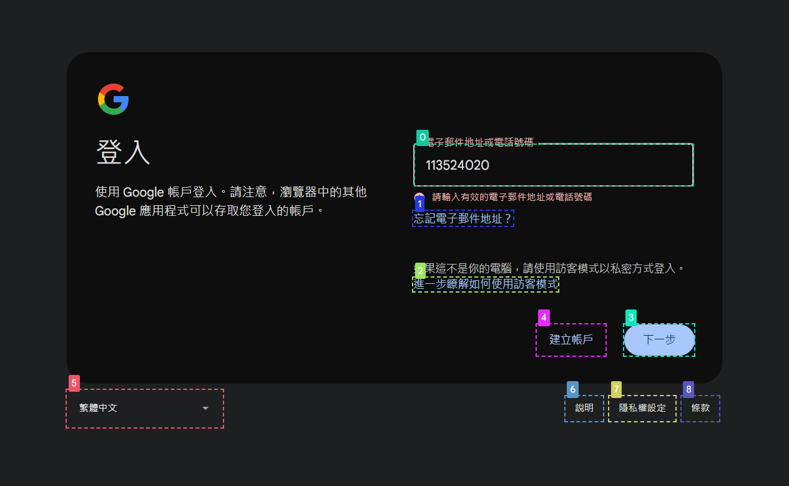
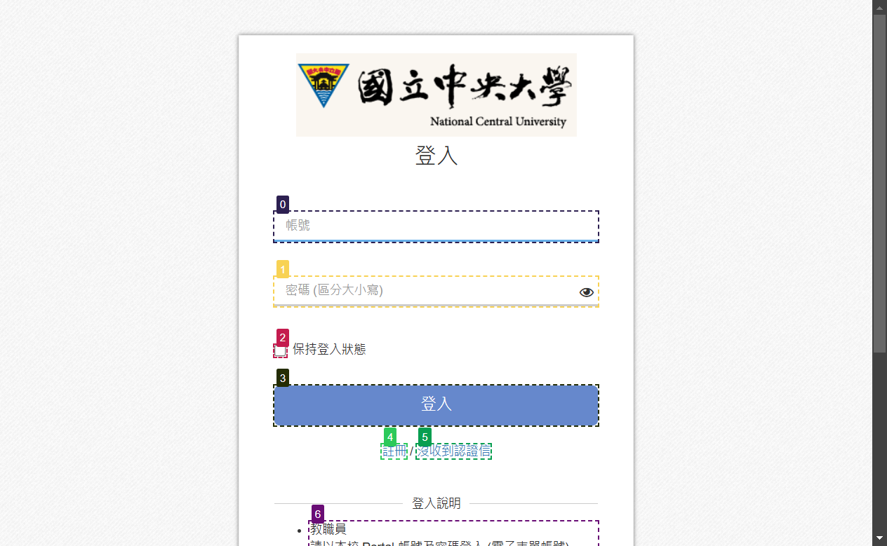
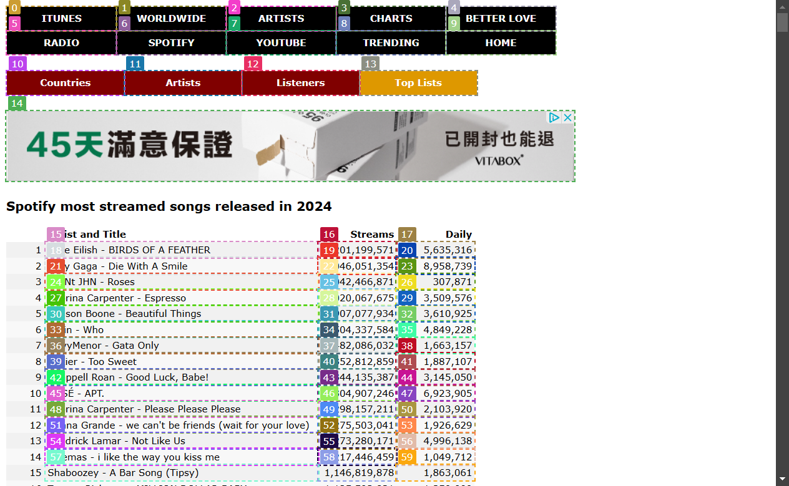
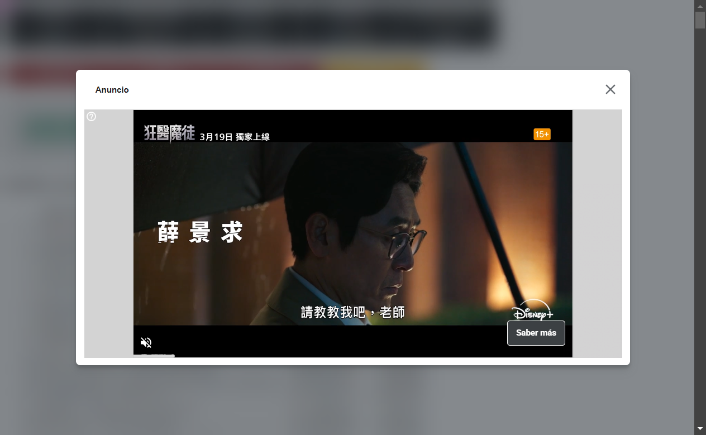

# WebVoyager  
AI agnet 操作
` python .\run.py --test_file data/tasks_test.jsonl `
以 gpt-4o-mini進行操作

## Search Flight  

` python .\run.py --test_file data/SeachFlight.jsonl --api_key API_HEY --api_model gpt-4o-mini `  

Prompt: 要求尋找今年10/1台北到日本最便宜的機票  
Result: 在google > 航班 找尋出最便宜的機票

  
---
## Find NCU Career  
` python .\run.py --test_file data/FindNCUCareer.jsonl --api_key API_HEY--api_model gpt-4o-mini `

Prompt: 要求尋找中央大學今年的企業博覽會相關資訊
Result: 以google進行關鍵字搜尋 > 點入職捱嘉年華

---
## Login eeclass  
` python .\run.py --test_file data/LogIneeclass.jsonl --api_key API_HEY--api_model gpt-4o-mini `

Prompt: 要求登入中央大學eeclass (已給帳號及密碼)
Result1: 在一剛開始prompts指令未下清楚，導致Webvoyager會嘗試登入google帳號

Result2: 以google取得eelcass網站 > 輸入帳號密碼 > 無法登入
在登入過程中 ，嘗試輸入帳號後會直接進行輸出而無法正確輸入密碼儘管在"interact_message.json"中有提到會兩者皆輸入
>To log in to the EEClass system, I need to input the username in the textbox labeled [0] and the password in the textbox labeled [1]. After entering both, I will click the login button labeled [3] to proceed.\n\nAction: Type [0]; 113524020

---
## Youtube Search  
` python .\run.py --test_file data/YoutubeSearch.jsonl --api_key API_HEY--api_model gpt-4o-mini `
Prompt: 要求搜尋2024撥放量最高的歌曲並在Youtube進行撥放
Result: 可以取得最高的撥放量歌曲，在下一步前往youtube時會點擊此網站"youtube"前往，而網站會在此跳出廣告並且無法進行點擊x或是其他方式進行刪除，導致無法前往youtube。或許在這部分需要拆成兩部分進行網頁搜尋會是較為恰當的結果。
> with the highest streams showing Billie Eilish's \"BIRDS OF A FEATHER.\"

