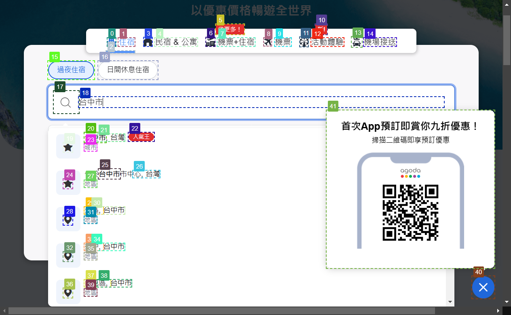
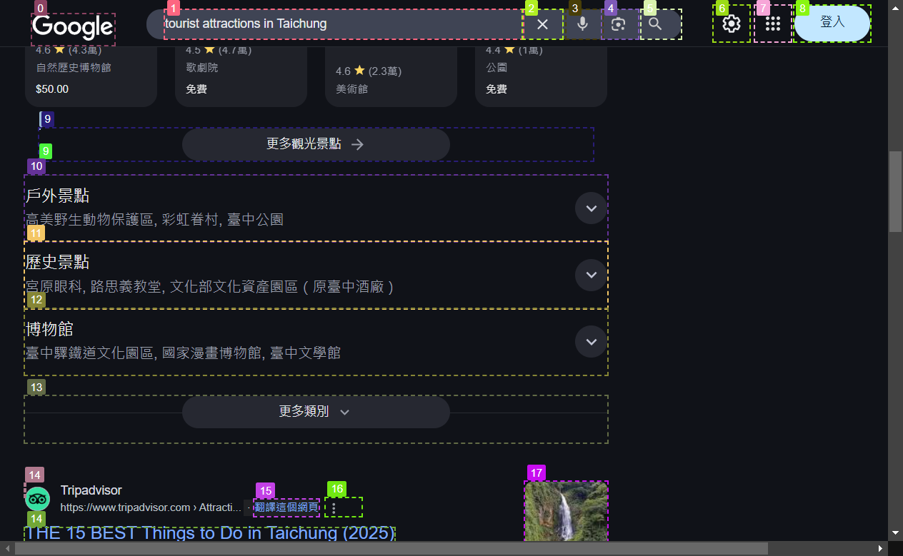
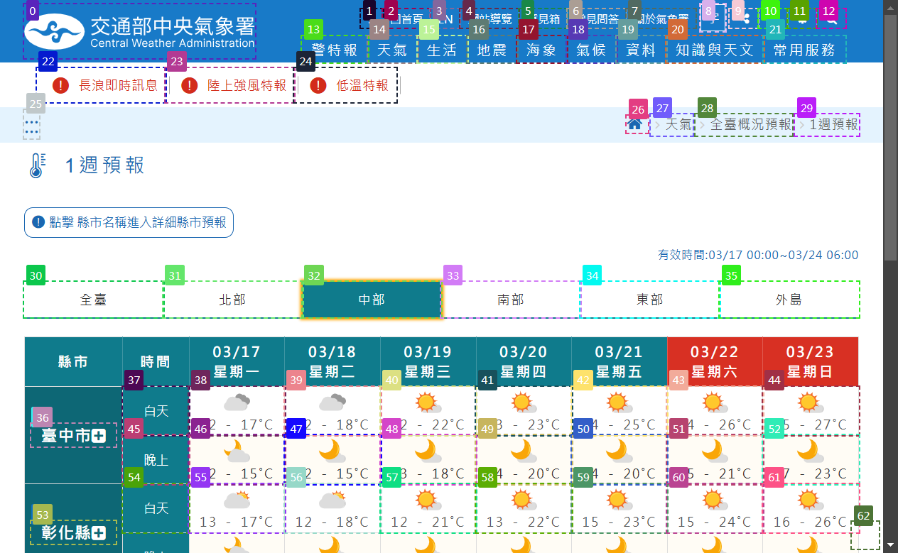

## WebVoyager
 
### AI agnet 操作

python .\main.py  --api_key "API_KEY" --api_model gpt-4o-mini

### 主題
**旅遊小助手**

1. 幫助旅客尋找合適的飯店
2. 尋找旅客適合的景點
3. 提供當地的天氣預報

### 更改內容

#### 1. 新增PROMPT 
修改 prompt.py 

`TRAVEL_PROMPT = """
You are a professional travel consultant. 
You need to ask the customer where they are traveling to this time.
"""`  
提示gpt主要功能是旅遊助手，以幫助旅客處理相關問題  

`FORMAT_SETTING_PROMPT = """You will receive travel-related information. Please convert it into the following format.And only display the content in JSONL format! Also, do not repeat the same task. ## Task Setting example What are the family-friendly hotels in New York City for a budget of $250 per night?" ## Hotel Information{"web_name": "Agoda", "id": "Adoga", "ques": "Task.", "web": "https://www.agoda.com/}"## Weather Information
{"web_name": "weather", "id": "weather", "ques": "Tasks.", "web": "https://www.cwa.gov.tw/V8/C/W/week.html"}## Tourist Attraction Information{"web_name": "Google", "id": "google", "ques": "Task.", "web": "https://www.google.com/}"## Notice
Please check if your data has been updated or corrected, prioritizing 'content' in order from old to new.
"""`  
用來設定此助理可以做甚麼事並且根據這些規則進行回覆及設定格式  

`TRAVEL_END_PROMPT =""" You are a professional travel consultant, and your service has now ended. Based on the previous conversation, please provide a brief summary of this experience."""`  
希望可以為此次一輪作總結  

#### 2. 新增main.py內容
類似於agent，主要用來處理旅客的事項並將問題處理後再傳給WebVoyager做網頁的尋找。因此，新增`prompts.py`指令使agent的工作事項能夠更加準確。  
透過此方式使用者體驗會更加提高，可以更加即時的修正目前的需求。  

#### 3. 修改run.py指令
由於已新增`main.py`，因此修正了`run.py`指令讓task可以直接進行接收，而非再透過jsonl進行處理。  

### 執行結果

經測試後可以更新`main.py`的記憶  
#### 1. i want to go to taipei on 3/19-3/20
> Thought: The screenshot indicates that I need to finalize my search by clicking on the search button after entering "台北市" (Taipei City) in the input field labeled [18]. The search button is not explicitly labeled in the provided details, but it seems I should simply proceed with the search.  

  
  
> Thought: The screenshot shows the weather forecast for Taipei from March 19 to 20, 2024. The forecast for these dates is labeled with 40 (March 19) and 41 (March 20). The information needed is visible under these labels.  
  
   
>  Thought: The screenshot displays a list of tourist attractions in Taipei, showing various options with their names, ratings, and some prices. To gather more details, I will click on the first attraction, "國立中正紀念堂" ([22]), as it appears to have the most information and is highlighted.  

> Thought: The screenshot shows the weather forecast for Taipei from March 19 to 20, 2024. The forecast for these dates is labeled with 40 (March 19) and 41 (March 20). The information needed is visible under these labels.   
 
#### 2. oh, i want change to go to taichang, the day is same

>Thought: The screenshot indicates that I can search for hotels in Taichung using the input field labeled [18]. The relevant button to finalize the search does not appear to be explicitly labeled in the current view, but the search action should typically be executed as soon as the city is entered. Since I have already entered the city name, I will perform a click action on the search functionality to proceed with finding family-friendly hotels.  

> The screenshot shows various tourist attractions in Taichung divided into categories like outdoor spots, historical sites, and museums. There are also additional links, like "THE 15 BEST Things to Do in Taichung" from Tripadvisor. Given the relevant information, I will choose to explore more attractions by clicking on the button labeled [9].  

> The elements show a calendar with daily weather forecasts. For Taichung on March 19, 2024 (labeled [40]), it indicates a high of 22°C. On March 20, 2024 (labeled [41]), it indicates a high of 23°C. The information is present in a clear format.  
