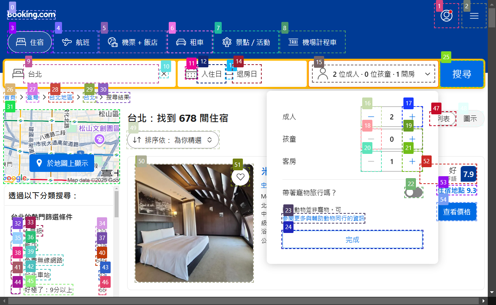
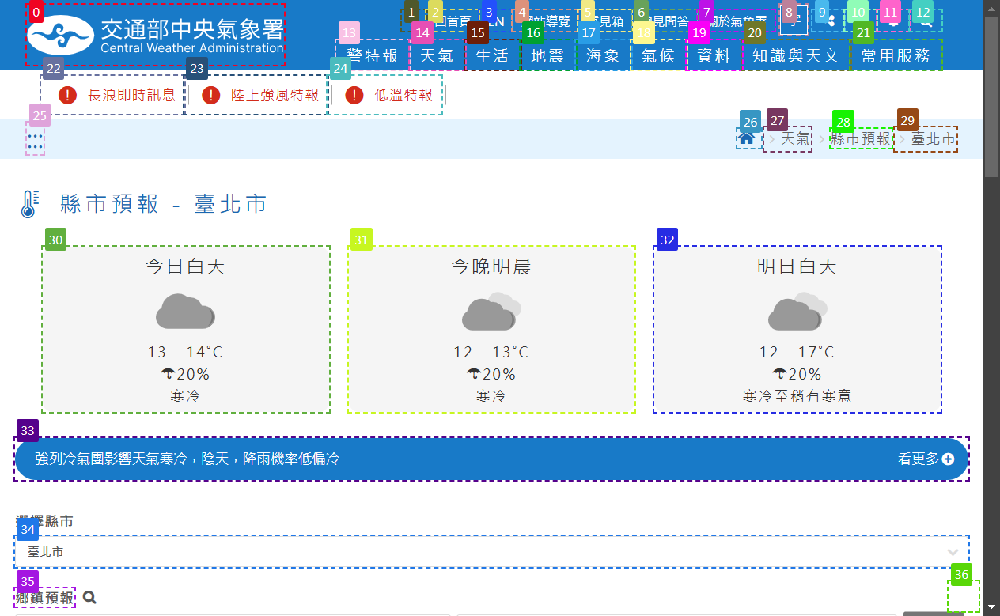
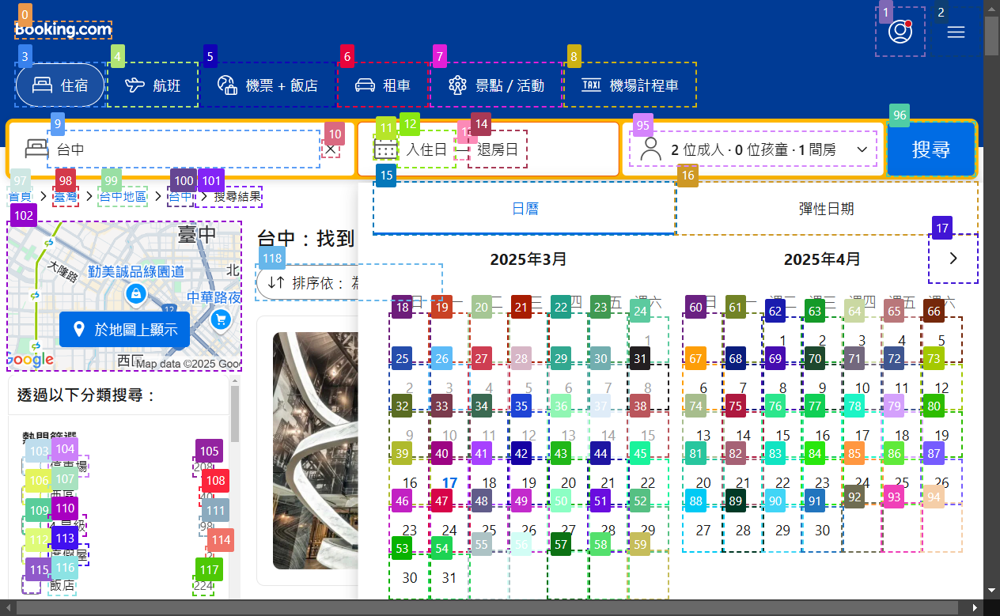
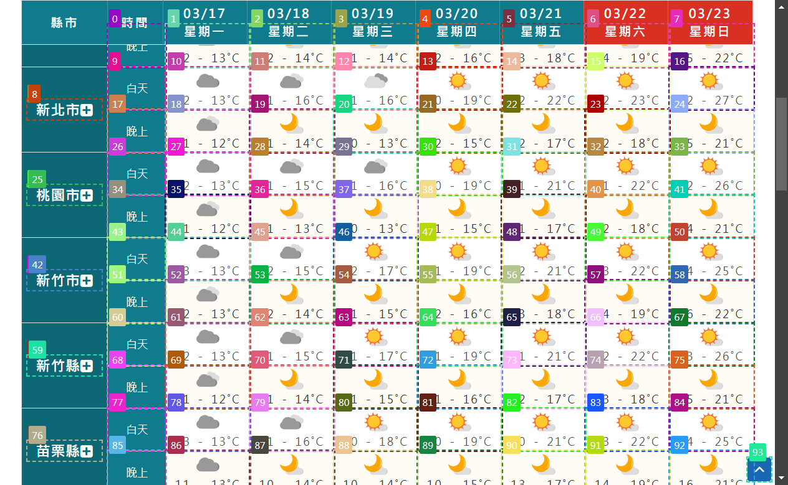

## WebVoyager
 
### AI agnet 操作

python .\main.py  --api_key "API_KEY" --api_model gpt-4o-mini

### 主題
**旅遊小助手**

1. 幫助旅客尋找合適的飯店
2. 尋找旅客適合的景點
3. 提供當地的天氣預報

### 更改內容

#### 1. 新增PROMPT 
修改 prompt.py 

`TRAVEL_PROMPT = """
You are a professional travel consultant. 
You need to ask the customer where they are traveling to this time.
"""`  
提示gpt主要功能是旅遊助手，以幫助旅客處理相關問題  

`FORMAT_SETTING_PROMPT = """You will receive travel-related information. Please convert it into the following format.And only display the content in JSONL format! Also, do not repeat the same task. ## Task Setting example What are the family-friendly hotels in New York City for a budget of $250 per night?" ## Hotel Information"web_name": "booking", "id": "booking", "ques": "Task.", "web": "https://www.booking.com/"## Weather Information
{"web_name": "weather", "id": "weather", "ques": "Tasks.", "web": "https://www.cwa.gov.tw/V8/C/W/week.html"}## Tourist Attraction Information{"web_name": "Google", "id": "google", "ques": "Task.", "web": "https://www.google.com/}"## Notice
Please check if your data has been updated or corrected, prioritizing 'content' in order from old to new.
"""`  
用來設定此助理可以做甚麼事並且根據這些規則進行回覆及設定格式  

`TRAVEL_END_PROMPT =""" I hope you can provide a complete summary or plan based on the above content, and communicate with the traveler in a professional and engaging manner, so that they can have a well-rounded travel experience based on your response."""`  
為此次一輪作總結  

#### 2. 新增main.py內容  
類似於agent，主要用來處理旅客的事項並將問題處理後再傳給WebVoyager做網頁的尋找。因此，新增`prompts.py`指令使agent的工作事項能夠更加準確。  
透過此方式使用者體驗會更加提高，可以更加即時的修正目前的需求。  

#### 3. 修改run.py指令  
由於已新增`main.py`，因此修正了`run.py`指令讓task可以直接進行接收，而非再透過jsonl進行處理。  

### 思考邏輯  

`main.py`  
1. 在旅客使用此專案是會依照`prompts.py/TRAVEL_PROMPT`詢問說"本次旅遊要前往的地點"   
2. 將旅客的需求透過`prompts.py/FORMAT_SETTING_PROMPT`轉換`list`格式並做成Tasks  
 
`run.py`  
3. 將Tasks透過WebVoyager進行網頁搜索  

`main.py`   
4. 輸出至前端讓顧客明瞭目前的執行進度以及思考內容    
5. 回到第三步直至Tasks完成  
6. 將所有的Tasks的內容儲存並且透過`prompts.py/TRAVEL_END_PROMPT`進行本次旅遊體驗的總結  
7. 回到第一步直至結束  

   

### 執行結果

經測試後可以更新`main.py`的記憶  
#### main.py 
1.   第一次嘗試  
輸入 I want to go to taipei from 3/19 to 3/20   
產出以下Prompt  
- what are some family-friendly hotels in Taipei for a budget of $250 per night?
- What is the weather forecast in Taipei for March 19 and 20?
- What are the top tourist attractions to visit in Taipei?

最後總結   
Dear Traveler,

I am excited to assist you in planning your upcoming trip to Taipei! Below is a summary of your travel details, including hotel accommodations, weather forecast, and must-see attractions to enhance your travel experience.

### Accommodations

Please confirm the following details for your hotel search:
- **Number of Adults:** 2
- **Number of Children:** 0

Once you finalize your selection, we can proceed with booking the perfect hotel for your stay!

### Weather Forecast

It's essential to prepare for the weather during your trip. Here’s the forecast:
- **Today (March 19):** Temperature will be between 13 - 14°C, with a 20% chance of rain.
- **Tonight:** Mild temperatures are expected, so be sure to stay comfortable.
- **Tomorrow (March 20):** A range of 12 - 17°C with a 20% chance of rain. It may be good to carry an umbrella just in case!

### Tourist Attractions

While you're in Taipei, I recommend exploring some fantastic attractions. Here are the highlights from recent recommendations:
- **Taipei 101** – Experience breathtaking views from one of the tallest buildings in the world.
- **National Palace Museum** – Discover thousands of years of Chinese art and history.
- **Shilin Night Market** – Enjoy local delicacies and vibrant culture at this bustling night market.
- **Chiang Kai-shek Memorial Hall** – A significant historical landmark with beautiful architecture.

You can find more details and recommendations on activities by checking the comprehensive guide titled “THE 15 BEST Things to Do in Taipei (2025)” on Tripadvisor [insert link or reference].

### Next Steps

1. **Finalize Hotel Selection:** Please let me know the hotel selection once you complete your search.
2. **Weather Preparedness:** Pack accordingly based on the weather forecast to ensure comfort during your trip.
3. **Explore Attractions:** Consider adding a few of the recommended places to your itinerary, and let me know if you’d need assistance with reservations or further suggestions.

I hope this helps you create a memorable travel experience in Taipei! Should you have any questions or need further assistance, feel free to reach out.

Safe travels and enjoy your adventure!

Warm regards,

[Your Name]
Travel Advisor
2. 第二次嘗試  
輸入 oh, i want change to go to taichang, the day is same   
產出以下prompts   
- What are some family-friendly hotels in Taichung for a budget of $250 per night?
- What is the weather forecast in Taichung for March 19 and 20?  
- What are the top tourist attractions to visit in Taichung?
   
最後總結   
**Travel Plan for Taichung, Taiwan (March 2025)**

**Check-in Date:** March 1, 2025
**Check-out Date:** March 20, 2025

### Weather Overview
- **March 19:** Cloudy with temperatures between 12°C to 14°C.
- **March 20:** Sunny, a pleasant day to explore with temperatures ranging from 13°C to 19°C.

### Suggested Itinerary
#### Week 1: Arrival and Exploration
- **March 1-3:** Arrive in Taichung; settle in and explore your immediate surroundings.
- **March 4-5:** Visit:
  - **草悟道 (Greenway):** Enjoy a leisurely walk in this beautiful urban park.
  - **東海大學 (Tunghai University):** Explore the campus and the iconic Luce Memorial Chapel.

#### Week 2: Culture and Night Markets
- **March 6-12:** Dive into Taichung’s vibrant culture.
  - **濟中公園 (Jichung Park):** Perfect for a relaxing day outdoors.
  - **濟中公園 (Jichung Park):** Perfect for a relaxing day outdoors.
  - **士林夜市 (Shilin Night Market):** Experience local nightlife and delicious street food.

#### Final Days: Art and Temples
- **March 13-19:**
- **March 13-19:**
  - **幻藝博物館-台中 (Taichung Art Museum):** Explore contemporary art.
  - **大甲鎮瀾宮 (Dajia Jenn Lann Temple):** Visit one of the most famous temples in Taiwan.

- **March 19:** Check the weather forecast and plan for a day of outdoor sightseeing and photo opportunities, considering the sunny conditions.
- **March 19:** Check the weather forecast and plan for a day of outdoor sightseeing and photo opportunities, considering the sunny conditions.

### Additional Tips
- **Transportation:** Utilize local buses or bike rentals to navigate easily around the city.
- **Transportation:** Utilize local buses or bike rentals to navigate easily around the city.
- **Cuisine:** Don’t miss out on trying local specialties such as beef noodle soup and bubble tea.
- **Cuisine:** Don’t miss out on trying local specialties such as beef noodle soup and bubble tea.
- **Connectivity:** Ensure you have a local SIM card or portable Wi-Fi for navigation and communication.

### Conclusion
Taichung offers a mix of natural beauty, cultural experiences, and culinary delights. Plan your days to balance leisure and exploration, and enjoy the rich tapestry of experiences this vibrant city has to offer.

Feel free to adjust the itinerary based on your interests, and let me know if you have any questions or need further assistance in planning your trip!

---
#### run.py (WebVoyager) 

1. I want to go to taipei from 3/19 to 3/20

> Prompt: What are some family-friendly hotels in Taipei for a budget of $250 per night?  

> Thought: I need to specify the number of adults and children for the hotel search. I will select the desired number (2 adults and 0 children) and then click the "完 成" button [24] to finalize this selection.   

  

> Prompt: What is the weather forecast in Taipei for March 19 and 20?
 
> Action: ANSWER; The weather forecast in Taipei for March 19 is 13 - 14°C with a 20% chance of rain, and for March 20, it is 12 - 17°C with a 20% chance of rain.

> Prompt: What are the top tourist attractions to visit in Taipei?

> Thought: The search results show various tourist attractions in Taipei, including "THE 15 BEST Things to Do in Taipei (2025)" with ratings, and links from sources such as Tripadvisor. I need to click on the link labeled [30] to gather detailed information about the attractions.
  
   

2. oh, i want change to go to taichang, the day is same  
 
> Prompt:  What are some family-friendly hotels in Taichung for a budget of $250 per night?
> Thought: I need to select the check-in date for my search. The previous label indicated a need to set the check-out date, but it seems I still need to click a calendar date for check-in. I'll select the first available date in March 2025, which is March 1 (Numerical Label [24]).\n\nAction: Click [24]

> Prompt: What is the weather forecast in Taichung for March 19 and 20?  

> Thought: The screenshot displays the weather for Taichung on March 19 and 20. For March 19, the icon indicates cloudy weather with a temperature range of 12\u00b0C to 14\u00b0C. For March 20, it shows sunny weather with a temperature range of 13\u00b0C to 19\u00b0C. These details correspond to numerical labels in the screenshot.\n\nAction: Click [3]  

> Prompt: What are the top tourist attractions to visit in Taichung?

> Thought: The search results show several tourist attractions in Taichung. The attractions listed include \u8349\u609f\u9053 (Greenway), \u6771\u6d77\u5927\u5b78 (Tunghai University), \u6fdf\u4e2d\u516c\u5712 (Jichung Park), \u58eb\u6797\u591c\u5e02 (Shilin Night Market), \u5e7b\u85dd\u535a\u7269\u9928-\u53f0\u4e2d (Taichung Art Museum), \u5927\u7532\u93ae\u703e\u5bae (Dajia Jenn Lann Temple), and others, along with their ratings and categories. To continue gathering more information, I will scroll down to view additional results.\n\nAction: Scroll [WINDOW]; down

