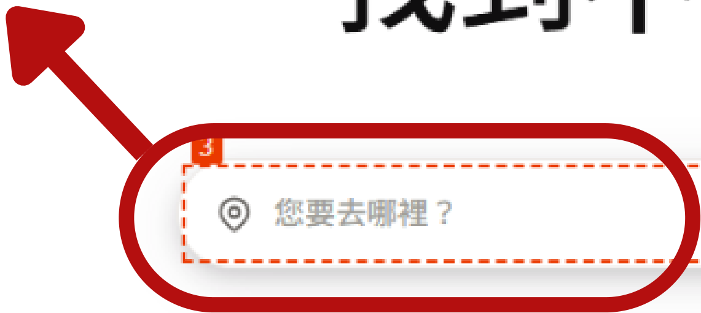
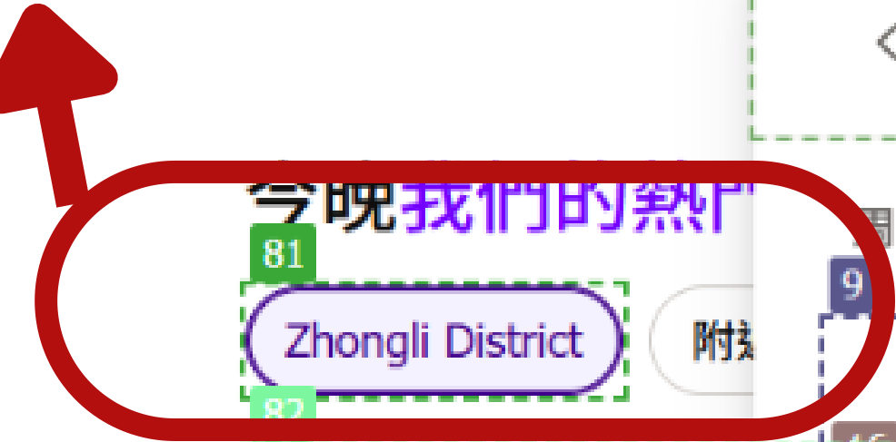
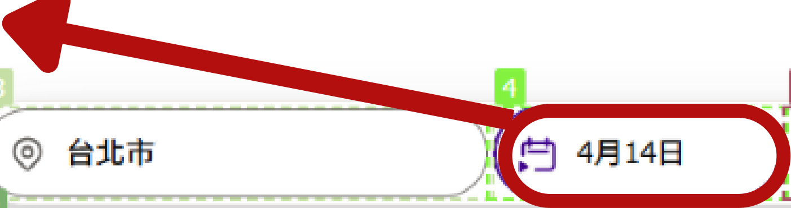
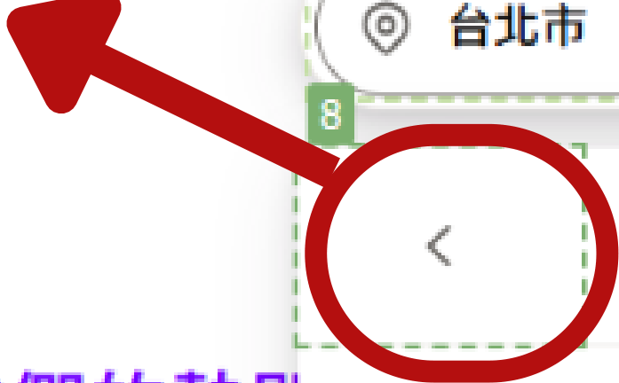
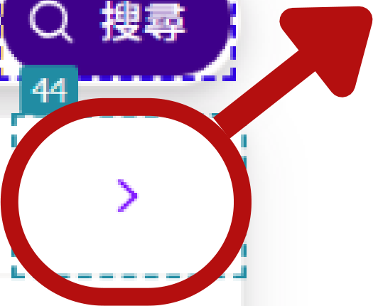
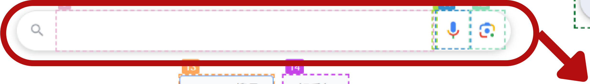
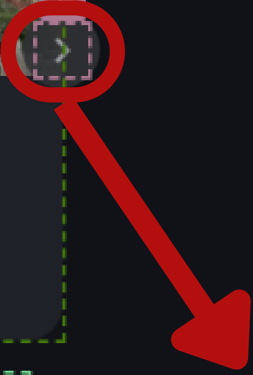

## 訂房網頁導覽

# 訂房網站

[https://www.etrip.net/](https://www.etrip.net/)

提供各種服務

列出國內外不同的飯店

根據旅客需求提供最合適的飯店

透過設定可以滿足更多需求

以etrip作為舉例

### 網頁介紹

搜尋列: 分別為(1)⽬目的地(2)訂房⽇日(3)退房⽇日
(4)旅客⼈人數及客房數量

你的查詢內容
### 網頁介紹

網頁查詢步驟 step1. 輸入要前往的目的地

網頁查詢步驟 step1. 輸入要前往的目的地

網頁查詢步驟 step 2.點擊訂房日

網頁查詢步驟 step 3.點擊入住日期

網頁查詢步驟 step 3.點擊入住日期

若是⽉月份與訂房時間不同，點擊箭頭處

![The image is a screenshot of a website, likely related to hotel booking or travel planning. It features a calendar display showing April and May of 2025 with various numbers on the dates, which might indicate prices or availability. There are options to search, select dates, and navigate between months. Some text in Chinese includes phrases for moving to the previous or next month, and a suggestion to find unpublished hotel deals. Additionally, there's an image of a hotel room labeled for the "Zhongli District."](images/instruction_manual.pdf-8-2.png)

網頁查詢步驟 step 4.點擊退房日

網頁查詢步驟 step 5.點擊退房日期

網頁查詢步驟 step 5.點擊退房日期

若是⽉月份與退房時間不同，點擊箭頭處

網頁查詢步驟 step 6.確認訂房數量及旅客
人數

網頁查詢步驟 step 7.點擊搜尋

網頁查詢步驟 step 7.選擇飯店

網頁查詢步驟 step 7.選擇飯店

若是不符合需求，可向下滾動已獲得符合需求的飯店，禁止提早結束

飯店查詢注意事項

1.當你在地點輸入欄輸入值（例如「台北」）後，只要該值顯示在輸入框內，即視為

有效且已被接受。

2. 不要被頁面其他靜態或無關區域誤導（例如頁尾或預設的舊地區名稱如「中壢

區」）。
3.完成輸入後，不要因為頁面上舊內容而反覆檢查或重點同一輸入欄位。
4.請專注於你輸入的目的地，忽略其他無關區域的內容！！！
5.當找到符合條件的飯店時，請回報以下資訊：

a.飯店名稱

b.每晚價格

c.可容納人數

d.可入住的日期

## 天氣查詢導覽

# 天氣預報

https://www.cwa.gov.tw/V8/C/W/week.html

提供各地區的天氣預測

一個禮拜的天氣預測

可根據不同區域做查詢

查看白天及晚上的天氣

以交通部中央氣象署作為舉例

### 網頁介紹

天氣預測

### 網頁介紹

【全台】(Tag30)
含有全台灣的天氣。

【北部】(Tag31) 台灣北部天氣，
含有:基隆市、臺北市、新北市、桃

園市、新竹市、新竹縣及苗栗縣

【中部】(Tag32) 台灣中部天氣，
含有:臺中市、彰化縣、南投縣、雲

林縣、嘉義市及嘉義市

【南部】(Tag33) 台灣南部天氣，

含有:臺南市、高雄市及屏東縣

【東部】(Tag33) 台灣東部天氣，

含有:宜蘭縣、花蓮縣及臺東縣

【外島】(Tag34) 台灣外島天氣，

含有:澎湖縣、金門縣及連江縣

天氣查詢步驟 step 1. 根據任務點選區域，唯一有進行點擊的動作

各區域按鈕

天氣查詢步驟 step 2. 查閱地區天氣

各地區天氣

天氣查詢步驟 step 2. 查閱地區天氣

若是⽬目前畫⾯面沒有顯⽰示符合任務需求的地點，請向下滾動

你需要在這個畫面找到你需要的資訊，禁止點擊進入下個畫面

各地區天氣

天氣查詢注意事項

1.請在同個頁面完成任務需求，不須跳轉至其他頁面，你不需要在找到地區之後還需要點擊而進入下個網頁

2.取得地區天氣後，請返回以下內容

a.當日天氣包含早上及晚上

## 景點查詢導覽

# 景點查詢

[https://www.google.com/](https://www.google.com/)

最大的搜尋引擎

提供各式不同景點內容

提供完整的資訊

最完整的資料

以google作為舉例

### 網頁介紹

### 網頁介紹

網頁查詢步驟 step 1. 輸入要查詢的內容

網頁查詢步驟 step 2. 查閱查詢結果

網頁查詢步驟 step 3. 取得更多樣的結果

景點查詢注意事項

1.請盡量在google的頁面上完成任務，不需進入其他個人網頁或旅遊網頁

2.取得景點資料後，請返回以下內容

a.景點名稱

b.票價(若有需求)

c.營業時間(若有提供)

d....等其他有關景點相關資訊

